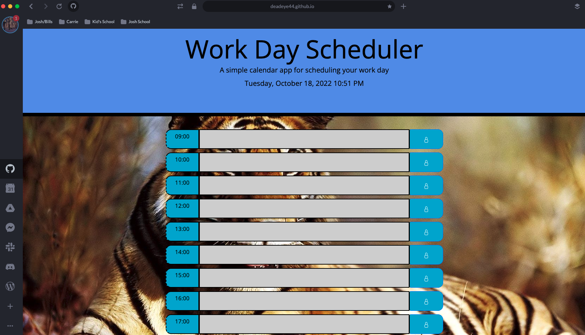

# 05 Third-Party APIs: Work Day Scheduler

## My Task

This week my task was to create a simple calendar application that allows a user to save events for each hour of the day by modifying starter code. The app runs in the browser and features dynamically updated HTML and CSS powered by jQuery.
# Mock-Up

The following image shows the web application's appearance and functionality:

## Review

I am submitting the following for review:

* The URL of the deployed application

* The URL of the GitHub repository, with a unique name and a README describing the project.
